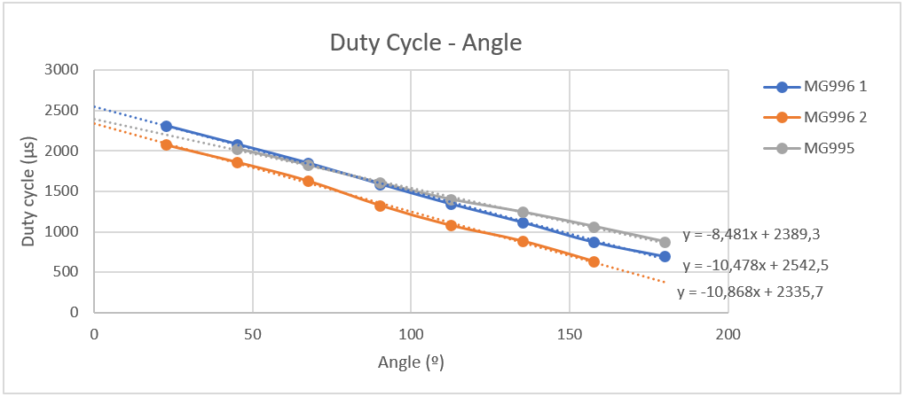

DELTA PROJECT
==================
**Code for the Microcontrolers project at URV university**

This is a small scale Delta robot. It's intented to play chess even
though the servo accuracy its not the best. Me and my class partner will
try to mitigate the problems associated with the cheap servos we are using
(MG995 and MG996) and be able to get a decend accuraty and repeatability
to finally beat someone at chess.

We work both with an Arduino Uno and a PIC24FJ128GA010 so to avoid typing
the same code twice we writed some code to integrate the arduino files into
the PIC24. Some features have to be tweeked a little bit, but overall it works.

The current features of the code:

:Joystick:	  Delta angles and XYZ axis moved by a joystick
:Calibration: Calibrate duty cycles with potentiometer and buttons
:SerialCom:	  Communicate with a simulator through serial commands
:EaseServos:  Eased servos and syncronized servo movement
:Sequence:	  Store a sequence and make it repeat

CALIBRATION
==================

